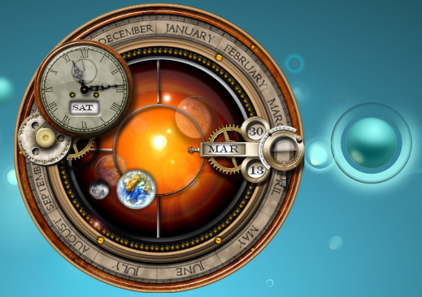

Time Keeper
===========
This plasmoid provides a clock and a calendar functions via steampunk interface.  
It's entirely written in QML + JavaScript.

This plasmoid is a port of [Steampunk orrery](http://lightquick.co.uk/downloads/steampunk-orrery-xwidget.html)  
Plasmoid [Luna QML](http://kde-apps.org/content/show.php?content=140204) was also used

Installation
------------

Run the following in the main directory of the project:

    plasmapkg -i timekeeper.plasmoid

Create package
--------------

Run the following in the plasmoid directory of the project:

    zip -r ../timekeeper.zip .  
    mv ../timekeeper.zip ../timekeeper.plasmoid
  
  

